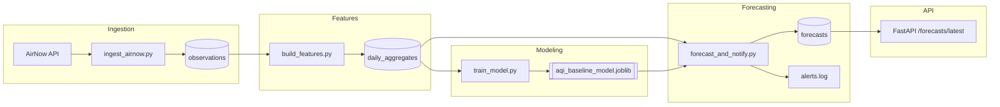

# Automated Air Quality Forecasting Pipeline (Oregon AQI)

<details>
  <summary><strong>Project Badges</strong> (click to expand)</summary>

  
  
  
  
</details>

This project implements an **automated end-to-end pipeline** for collecting air quality data in Oregon, storing it in PostgreSQL, transforming it into daily aggregates, generating forecasts using a baseline AQI model, and logging alerts when poor air quality is expected.

It is designed as a real-world MLOps-style workflow: modular, scheduled, reproducible, and easy to extend with more sophisticated models later.

---

## Overview

The pipeline performs the following tasks:

### 1. Ingestion
- Pulls real-time AQI observations from the **AirNow API**
- Stores raw hourly measurements in a PostgreSQL database (`observations` table)

### 2. Daily Aggregation
- Converts raw observations into daily metrics per location:
  - `max_aqi`
  - `mean_aqi`
  - `min_aqi`

### 3. Forecasting
- Uses a saved baseline model (persistence strategy)
- Predicts *next-day AQI* for each Oregon location
- Writes results into the `forecasts` table

### 4. Alerting + Logging
- Checks if forecasted AQI exceeds a threshold (default: **100**)
- Writes alerts to `logs/alerts.log`
- Prints alerts to the console when forecasting runs

### 5. API Layer
- Exposes a FastAPI service that:
  - Provides a health check endpoint
  - Returns the latest forecast per location
  - Includes interactive docs via Swagger UI

### 6. Automation & Scheduling
- Provides Windows batch scripts for:
  - Ingestion
  - Aggregation
  - Forecasting
  - Orchestrating the entire pipeline
- Can be scheduled via **Windows Task Scheduler** to run automatically once per day.

### 7. CI & Testing
- Uses `pytest` for basic API tests
- Runs tests automatically in **GitHub Actions** on every push to `main`

---

## Architecture Diagram (Mermaid)



---

## Project Structure

```
aqi-forecasting-pipeline/
├── .venv/
├── data/
│   ├── raw/
│   └── processed/
├── logs/
│   └── alerts.log
├── models/
│   └── aqi_baseline_model.joblib
├── sql/
│   ├── schema.sql
│   └── seed_locations.sql
├── src/
│   ├── config/
│   │   └── settings.py
│   ├── db/
│   │   ├── connection.py
│   │   ├── init_db.py
│   │   └── seed_locations.py
│   ├── ingest/
│   │   ├── airnow_client.py
│   │   └── ingest_airnow.py
│   ├── features/
│   │   └── build_features.py
│   ├── models/
│   │   ├── baseline_model.py
│   │   ├── train_model.py
│   │   └── train_ml_model.py
│   ├── api/
│   │   └── main.py
│   └── forecast_and_notify.py
├── tests/
│   └── test_health.py
├── .github/
│   └── workflows/
│       └── python-tests.yml
├── .env
├── .gitignore
├── LICENSE
├── ROADMAP.md
├── run_ingest.bat
├── run_build_features.bat
├── run_forecast_and_notify.bat
├── run_pipeline.bat
├── requirements.txt
└── README.md
```

---

## Environment Variables

```
AIRNOW_API_KEY=REPLACE_ME
DB_USER=postgres
DB_PASSWORD=REPLACE_ME
DB_HOST=localhost
DB_PORT=5433
DB_NAME=aqi_db
```

Do NOT commit `.env`.

---

## Running the Pipeline Manually

```
.venv\Scripts ctivate.bat
python -m src.db.init_db
python -m src.db.seed_locations
python -m src.ingest.ingest_airnow
python -m src.features.build_features
python -m src.models.train_model
python -m src.forecast_and_notify
```

---

## Master Orchestration Script

Run everything with:

```
run_pipeline.bat
```

---

## API Usage

```
uvicorn src.api.main:app --reload
```

Endpoints:

- `/health`
- `/forecasts/latest`
- `/docs`

---

## Alerting System

Alerts trigger when `forecast_aqi >= 100` and are written to:

```
logs/alerts.log
```

---

## Testing

```
pytest
```

---

## Continuous Integration

GitHub Actions workflow runs pytest on every push.

---

## Future Enhancements

- ML forecasting models
- Streamlit dashboard
- Dockerization
- Cloud deployment
- Multi-day forecasting
- Additional API endpoints

---

## Current Status

- AirNow ingestion ✔
- Daily aggregates ✔
- Baseline forecasting ✔
- Alerts ✔
- FastAPI service ✔
- CI testing ✔
- Automated scheduling via Task Scheduler ✔
- Master pipeline script ✔

---

## Notes

This project is part of a professional data engineering + ML portfolio.

