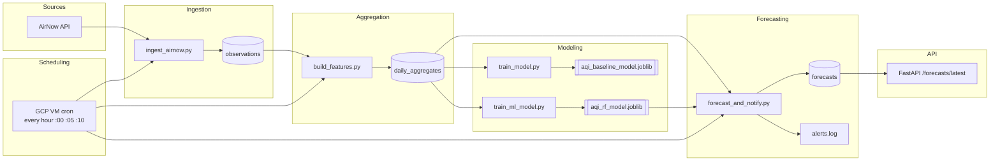

# Automated Air Quality Forecasting Pipeline (Oregon AQI)

<details>
  <summary><strong>Project Badges</strong> (click to expand)</summary>

  
  
  
  
</details>

An end-to-end automated pipeline that collects hourly air quality data for five Oregon cities, stores it in PostgreSQL, aggregates it into daily metrics, trains a RandomForest forecasting model, and triggers alerts when poor air quality is predicted. The pipeline runs continuously on a GCP VM via cron and is designed to be extended with additional models, data sources, and a dashboard.

---

## Architecture


```mermaid
flowchart LR
    subgraph Sources
        A[AirNow API]
    end

    subgraph Ingestion
        A --> B[ingest_airnow.py]
        B --> C[(observations)]
    end

    subgraph Aggregation
        C --> D[build_features.py]
        D --> E[(daily_aggregates)]
    end

    subgraph Modeling
        E --> F[train_model.py]
        E --> G[train_ml_model.py]
        F --> H[[aqi_baseline_model.joblib]]
        G --> I[[aqi_rf_model.joblib]]
    end

    subgraph Forecasting
        E --> J[forecast_and_notify.py]
        I --> J
        J --> K[(forecasts)]
        J --> L[alerts.log]
    end

    subgraph API
        K --> M[FastAPI /forecasts/latest]
    end

    subgraph Scheduling
        N[GCP VM cron\nevery hour :00 :05 :10] --> B
        N --> D
        N --> J
    end
```

---

## Pipeline Stages

### 1. Ingestion
- Pulls current AQI observations from the **AirNow API** for five Oregon locations
- Deduplicates on `(location_id, timestamp_utc, pollutant)` — safe to run multiple times per hour
- Stores raw hourly readings in the `observations` table

### 2. Daily Aggregation
- Aggregates the last 2 days of observations into `daily_aggregates` per location:
  - `max_aqi`, `mean_aqi`, `min_aqi`
- Upserts so mid-day re-runs refine the current day's aggregate as new readings arrive
- Clears the `is_interpolated` flag when real observations arrive for a previously estimated date

### 3. Forecasting
- Loads the last 10 days of real (non-interpolated) aggregates per location
- Computes lag and rolling features: `lag1`, `lag2`, `lag3`, `roll3`, `roll7`
- Predicts next-day `max_aqi` using a trained **RandomForest** model
- Writes results to the `forecasts` table

### 4. Alerting
- Checks if any forecast exceeds AQI **100**
- Logs alerts to `logs/alerts.log` with timestamps
- Prints alerts to stdout during each pipeline run

### 5. API
- FastAPI service exposing:
  - `GET /health` — health check
  - `GET /forecasts/latest` — latest forecast per location
  - `GET /docs` — Swagger UI

### 6. Scheduling
- Runs on a **GCP e2-micro VM** (Debian, `aqi-pipeline`)
- Cron fires at `:00`, `:05`, `:10` past every hour via `run_pipeline.sh`
- Logs written to `logs/pipeline.log`

---

## Models

Two models are maintained:

| Model | File | MAE (test set) | Role |
|---|---|---|---|
| Persistence baseline | `aqi_baseline_model.joblib` | 15.95 | Sanity check floor — any real model must beat this |
| RandomForest | `aqi_rf_model.joblib` | 13.93 | **Active forecasting model** |

MAE is in AQI units. The persistence baseline ("tomorrow = today") is retrained alongside the RF as a permanent reference point. New models must beat both to justify deployment.

---

## Data Quality

Historical gaps in `daily_aggregates` (caused by pipeline downtime) are filled using linear interpolation via `src/backfill_interpolate.py`. Interpolated rows are flagged with `is_interpolated = TRUE` and excluded from model training. If real observations later arrive for an interpolated date, the aggregation step overwrites the estimate and clears the flag.

**Gap statistics at time of backfill (2026-06-12):**

| Location | Real rows | Interpolated rows |
|---|---|---|
| Portland | 162 | 23 |
| Eugene | 169 | 16 |
| Salem | 165 | 20 |
| Bend | 156 | 29 |
| Medford | 168 | 17 |

All gaps were ≤ 5 consecutive days and caused by pipeline scheduling outages, not sensor failures.

---

## Database Schema

| Table | Key columns |
|---|---|
| `locations` | `id`, `name`, `latitude`, `longitude` |
| `observations` | `location_id`, `timestamp_utc`, `aqi`, `pollutant`, `raw_json` |
| `daily_aggregates` | `location_id`, `date`, `max_aqi`, `mean_aqi`, `min_aqi`, `is_interpolated` |
| `forecasts` | `location_id`, `target_date`, `forecast_aqi`, `model_name` |

---

## Project Structure

```
aqi-forecasting-pipeline/
├── logs/
│   ├── pipeline.log
│   └── alerts.log
├── models/
│   ├── aqi_baseline_model.joblib
│   └── aqi_rf_model.joblib
├── sql/
│   ├── schema.sql
│   └── seed_locations.sql
├── src/
│   ├── config/
│   │   └── settings.py
│   ├── db/
│   │   ├── connection.py
│   │   ├── init_db.py
│   │   └── seed_locations.py
│   ├── ingest/
│   │   ├── airnow_client.py
│   │   └── ingest_airnow.py
│   ├── features/
│   │   └── build_features.py
│   ├── models/
│   │   ├── baseline_model.py
│   │   ├── train_model.py
│   │   └── train_ml_model.py
│   ├── api/
│   │   └── main.py
│   ├── backfill_interpolate.py
│   └── forecast_and_notify.py
├── .github/
│   └── workflows/
│       └── python-tests.yml
├── .env
├── requirements.txt
├── run_pipeline.sh      ← VM/Linux cron entry point
└── README.md
```

---

## Environment Variables

```
AIRNOW_API_KEY=your_airnow_key

# Database
DB_USER=postgres
DB_PASSWORD=your_password
DB_HOST=localhost
DB_PORT=5432
DB_NAME=aqi_forecasting
```

Do not commit `.env`. The VM reads this file at runtime via `python-dotenv`.

---

## Setup (VM / Linux)

```bash
git clone https://github.com/stevenhowley/aqi-forecasting-pipeline.git
cd aqi-forecasting-pipeline
python3 -m venv .venv
source .venv/bin/activate
pip install -r requirements.txt
cp .env.example .env   # fill in credentials
python -m src.db.init_db
python -m src.db.seed_locations
```

## Running the Pipeline Manually

```bash
source .venv/bin/activate
python -m src.ingest.ingest_airnow
python -m src.features.build_features
python -m src.forecast_and_notify
```

## Training Models

```bash
python -m src.models.train_model       # baseline persistence model
python -m src.models.train_ml_model    # RandomForest model (prints MAE comparison)
```

## Running the API

```bash
uvicorn src.api.main:app --reload
```

Endpoints: `/health`, `/forecasts/latest`, `/docs`

---

## Testing

```bash
pytest
```

GitHub Actions runs pytest on every push to `main`.

---

## Dashboard

A Streamlit dashboard runs on the VM and is accessible at `http://34.105.84.238:8501`.

Features:
- **Forecast cards** — tomorrow's predicted AQI for each city, color-coded by severity
- **Historical trend chart** — daily max AQI over time with interpolated days marked separately
- **Forecast vs actual chart** — overlays predictions against real observations to evaluate model accuracy, with live MAE displayed
- **Location and date range filters** — sidebar controls to zoom into a specific city or time window
- **Raw data table** — expandable view of the underlying daily aggregates

To start the dashboard on the VM:

```bash
source .venv/bin/activate
streamlit run dashboard.py --server.port 8501 --server.address 0.0.0.0
```

---

## Current Status

- [x] AirNow ingestion (hourly, 5 Oregon locations)
- [x] Daily aggregation with upsert
- [x] Baseline persistence model
- [x] RandomForest model (MAE 13.93, active)
- [x] Forecasting and alerting
- [x] FastAPI service
- [x] CI testing (GitHub Actions)
- [x] GCP VM deployment with cron scheduling
- [x] Historical gap interpolation with audit flag
- [x] Streamlit dashboard (live at port 8501)
- [ ] Multi-day forecasting
- [ ] Weather data integration
- [ ] Dockerization
